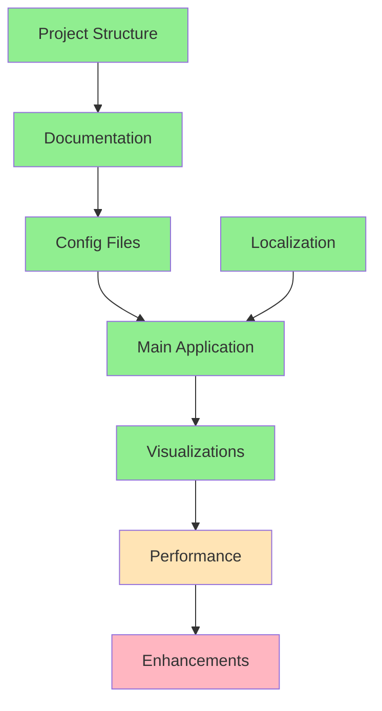

# Progress Tracking: Personal Finance Dashboard

## Project Status: Implementation Phase

## What Works
- Project structure established
- Documentation framework in place
- Core functionality implemented
- CSV file processing operational with correct formats
- Category management system working
- Basic visualizations implemented

## Current Development Status

### 1. Core Infrastructure

### 2. Feature Implementation Status
| Feature | Status | Notes |
|---------|--------|-------|
| Project Setup | ✅ Done | Complete with virtual environment |
| Documentation | ✅ Done | Memory bank established and maintained |
| Config Files | ✅ Done | categories.json implemented |
| CSV Parser | ✅ Done | Handles YYYYMMDD format and European numbers |
| Category System | ✅ Done | Dynamic categories with keyword learning |
| Visualization | ✅ Done | Basic pie charts and summaries |
| UI Components | ✅ Done | Dutch interface implemented |
| Date Handling | ✅ Done | Fixed YYYYMMDD format support |
| Number Format | ✅ Done | European number format support |
| Advanced Features | 🟨 In Progress | Performance optimization ongoing |
| Enhancements | ❌ Todo | Additional features planned |

## Completed Items

### Documentation
- ✅ Project brief defined
- ✅ System patterns documented
- ✅ Technical context established
- ✅ Product context documented
- ✅ Active context tracking set up

### Infrastructure
- ✅ Project directory structure
- ✅ Version control setup
- ✅ Configuration files
- ✅ Requirements file
- ✅ Virtual environment setup

### Core Features
- ✅ CSV file upload and parsing
- ✅ Transaction categorization
- ✅ Category management system
- ✅ Basic data visualization
- ✅ Tab-based interface
- ✅ Real-time category updates
- ✅ Data persistence
- ✅ Dutch language interface
- ✅ Proper date format handling
- ✅ European number format support

## In Progress

### Performance Optimization
- 🟨 Large file handling
  - Implementing chunked processing
  - Testing with various file sizes
  - Optimizing memory usage
- 🟨 Memory usage optimization
  - Memory profiling
  - Cache management
  - Resource cleanup
- 🟨 Category matching efficiency
  - Algorithm improvements
  - Keyword optimization
  - Pattern matching enhancements
- 🟨 Error handling improvements
  - User-friendly messages
  - Graceful failure modes
  - Input validation

## Pending Tasks

### Enhanced Features
1. Data Validation
   - [ ] CSV structure validation
   - [ ] Input sanitization
   - [ ] Error messaging
   - [ ] Format validation

2. User Experience
   - [ ] Loading indicators
   - [ ] Sorting and filtering
   - [ ] Export functionality
   - [ ] Advanced visualizations

3. Performance
   - [ ] Caching implementation
   - [ ] Progress indicators
   - [ ] Memory optimization
   - [ ] Large file handling

### Advanced Features
1. Transaction Management
   - [ ] Advanced filtering
   - [ ] Date range selection
   - [ ] Bulk operations

2. Analytics
   - [ ] Trend analysis
   - [ ] Spending patterns
   - [ ] Category insights

## Known Issues
- Large files may cause performance issues
- Basic error handling needs improvement
- Limited validation on CSV imports

## Next Milestones

### Milestone 1: Basic Features ✅
- [x] CSV file import with proper formats
- [x] Basic category management
- [x] Dutch interface implementation
- [x] Initial visualizations

### Milestone 2: Enhanced Features (Target: Q2 2025)
- [ ] Performance optimization
  - Chunked file processing
  - Memory usage improvements
  - Caching implementation
- [ ] Advanced filtering
  - Date range selection
  - Amount-based filtering
  - Category filtering
- [ ] Improved error handling
  - User-friendly messages
  - Validation feedback
  - Recovery options

### Milestone 3: Advanced Features
- [ ] Multi-file processing
- [ ] Advanced analytics
- [ ] Export functionality
- Target: TBD

## Testing Status
- Basic Functionality: Tested ✅
  - CSV import/export
  - Category management
  - Visualization rendering
- Format Handling: Tested ✅
  - Date formats (YYYYMMDD)
  - Number formats (European)
  - CSV structure
- Performance Testing: In Progress 🟨
  - Large file processing
  - Memory utilization
  - Response times
- Edge Cases: In Progress 🟨
  - Invalid data handling
  - Error scenarios
  - Boundary conditions

## Recent Updates
1. Fixed date format handling (YYYYMMDD)
2. Implemented European number format support
3. Added Dutch language interface
4. Improved CSV parsing

## Upcoming Focus
1. Implement performance optimizations
2. Add enhanced error handling
3. Develop advanced filtering capabilities
4. Add data validation features
