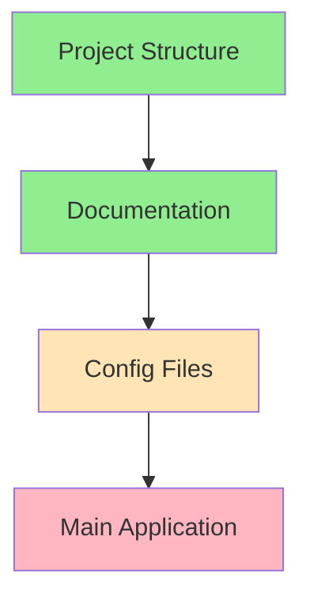

# Progress Tracking: Personal Finance Dashboard

## Project Status: Initial Setup Phase

## What Works
- Project structure established
- Documentation framework in place
- Bank statements directory created
- Basic configuration files initialized

## Current Development Status

### 1. Core Infrastructure

### 2. Feature Implementation Status
| Feature | Status | Notes |
|---------|--------|-------|
| Project Setup | ✅ Done | Basic structure complete |
| Documentation | ✅ Done | Memory bank established |
| Config Files | 🟨 In Progress | Initial files created |
| CSV Parser | ❌ Todo | Not started |
| Category System | ❌ Todo | Not started |
| Visualization | ❌ Todo | Not started |
| UI Components | ❌ Todo | Not started |

## Completed Items

### Documentation
- ✅ Project brief defined
- ✅ System patterns documented
- ✅ Technical context established
- ✅ Product context documented
- ✅ Active context tracking set up

### Infrastructure
- ✅ Project directory structure
- ✅ Version control setup
- ✅ Basic configuration files
- ✅ Requirements file

## In Progress

### Configuration
- 🟨 Categories.json structure
- 🟨 Application settings

## Pending Tasks

### Core Development
1. CSV Parsing
   - [ ] File validation
   - [ ] Data extraction
   - [ ] Error handling

2. Category Management
   - [ ] Category structure
   - [ ] Keyword matching
   - [ ] Rule persistence

3. Transaction Processing
   - [ ] Data validation
   - [ ] Category matching
   - [ ] Amount handling

4. Visualization
   - [ ] Chart components
   - [ ] Data aggregation
   - [ ] UI integration

### User Interface
1. Main Layout
   - [ ] File upload
   - [ ] Category management
   - [ ] Transaction view
   - [ ] Charts

2. Interaction Design
   - [ ] User flows
   - [ ] Error messages
   - [ ] Feedback system

## Known Issues
- None reported yet (project in initial phase)

## Next Milestones

### Milestone 1: Basic Functionality
- [ ] CSV file import
- [ ] Basic category management
- [ ] Simple transaction view
- Target: TBD

### Milestone 2: Core Features
- [ ] Automatic categorization
- [ ] Basic visualizations
- [ ] Category rules
- Target: TBD

### Milestone 3: Enhanced Features
- [ ] Advanced visualizations
- [ ] Performance optimization
- [ ] Export functionality
- Target: TBD

## Testing Status
- Unit Tests: Not started
- Integration Tests: Not started
- User Testing: Not started

## Recent Updates
1. Initial project structure created
2. Documentation framework established
3. Basic configuration files initialized

## Upcoming Focus
1. Implement core CSV parsing functionality
2. Develop category management system
3. Create basic UI components
