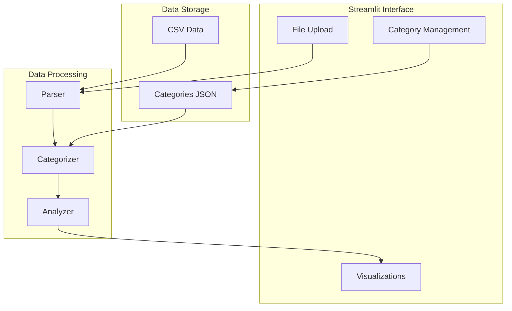
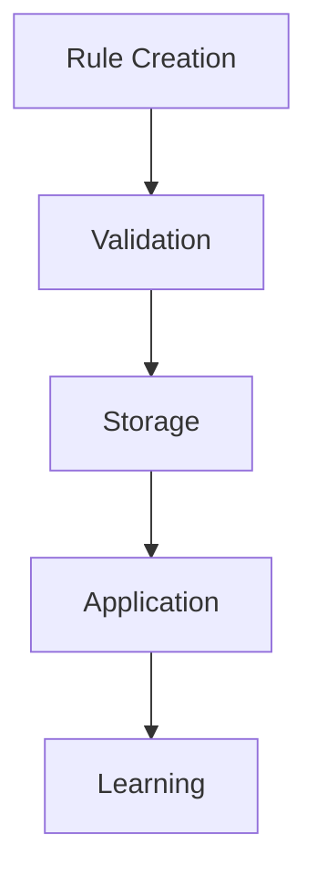

# System Patterns: Personal Finance Dashboard

## Architecture Overview

## Component Relationships

### 1. User Interface Layer
- **File Upload Component**
  - Handles CSV bank statement uploads
  - Validates file format and structure
  - Initiates data processing pipeline

- **Category Management Component**
  - Displays current categories
  - Manages category rules
  - Handles category CRUD operations

- **Visualization Component**
  - Renders pie charts for expenses
  - Displays transaction summaries
  - Shows category distributions

### 2. Processing Layer
- **Parser Component**
  - Reads CSV files using pandas
  - Validates data structure
  - Normalizes date formats and amounts

- **Categorizer Component**
  - Applies category rules to transactions
  - Handles keyword matching
  - Manages default categorization

- **Analyzer Component**
  - Aggregates transaction data
  - Calculates summaries
  - Prepares visualization data

### 3. Storage Layer
- **Categories Storage**
  - JSON-based category configuration
  - Persistent storage of rules
  - Category-keyword mappings

- **Transaction Storage**
  - CSV file handling
  - Temporary data caching
  - Session state management

## Design Patterns

### 1. Data Flow Pattern

### 2. Category Management Pattern

### 3. State Management
- Uses Streamlit session state
- Maintains category configurations
- Caches processed data

## Technical Decisions

### 1. File Processing
- Use pandas for CSV handling
- Process data in chunks
- Validate before processing

### 2. Category Rules
- Case-insensitive matching
- Keyword-based categorization
- Rule persistence in JSON

### 3. Visualization
- Streamlit native charts
- Clear color schemes
- Responsive layouts

### 4. Error Handling
- Graceful failure modes
- User-friendly error messages
- Data validation at each step

## Performance Considerations

### 1. Data Processing
- Optimize large file handling
- Efficient category matching
- Smart caching strategies

### 2. Memory Management
- Stream large files
- Clear unused cache
- Optimize data structures

### 3. UI Responsiveness
- Async data loading
- Progressive rendering
- Efficient state updates
