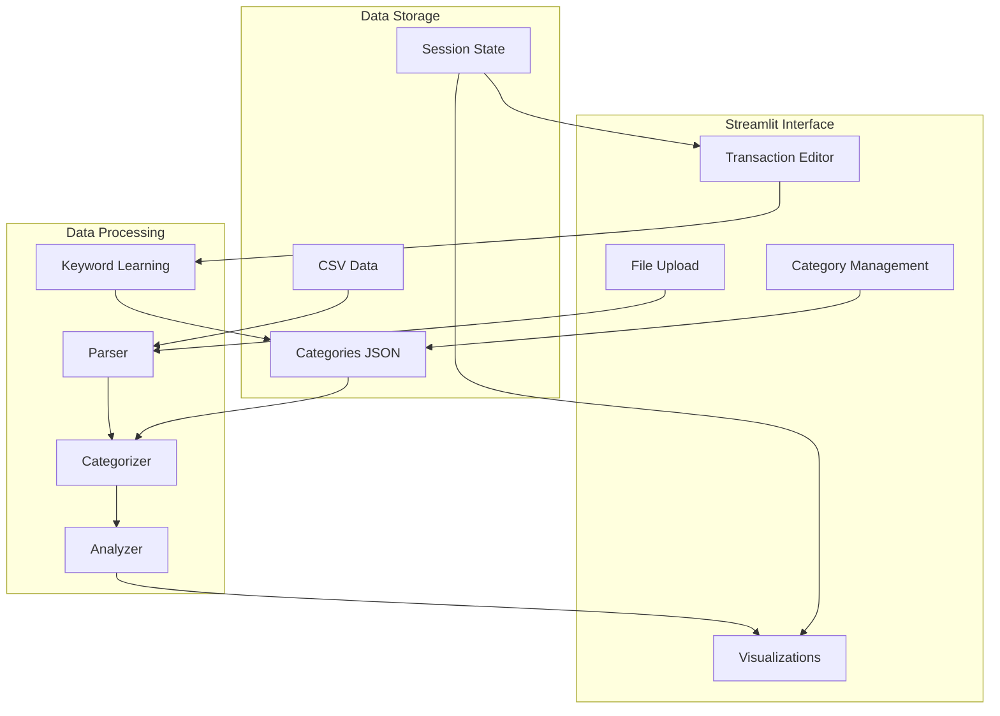
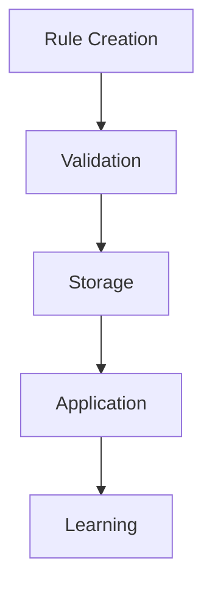

# System Patterns: Personal Finance Dashboard

## Architecture Overview

## Component Relationships

### 1. User Interface Layer
- **File Upload Component**
  - Handles CSV bank statement uploads
  - Validates file format and structure
  - Initiates data processing pipeline

- **Category Management Component**
  - Displays current categories
  - Manages category rules
  - Handles category CRUD operations
  - Supports dynamic category addition

- **Transaction Editor Component**
  - Interactive data grid for transactions
  - Real-time category updates
  - Triggers keyword learning

- **Visualization Component**
  - Renders pie charts for expenses
  - Displays transaction summaries
  - Shows category distributions
  - Separate views for debits and credits

### 2. Processing Layer
- **Parser Component**
  - Reads CSV files using pandas
  - Validates data structure
  - Normalizes date formats and amounts
  - Handles European number formats

- **Categorizer Component**
  - Applies category rules to transactions
  - Case-insensitive keyword matching
  - Manages default categorization
  - Real-time category updates

- **Keyword Learning Component**
  - Learns from manual categorizations
  - Updates category keywords
  - Maintains keyword associations

- **Analyzer Component**
  - Aggregates transaction data
  - Calculates summaries
  - Prepares visualization data
  - Separates debits and credits

### 3. Storage Layer
- **Categories Storage**
  - JSON-based category configuration
  - Persistent storage of rules
  - Category-keyword mappings
  - Dynamic updates support

- **Transaction Storage**
  - CSV file handling
  - Temporary data caching
  - European format support

- **Session State Storage**
  - Maintains UI state
  - Caches processed data
  - Handles real-time updates

## Design Patterns

### 1. Data Flow Pattern

### 2. Category Management Pattern

### 3. State Management
- Uses Streamlit session state
- Maintains category configurations
- Caches processed data

## Technical Decisions

### 1. File Processing
- Pandas for CSV handling with European formats
- CSV parsing with semicolon separator
- YYYYMMDD date format handling
- European number format (comma as decimal)
- Automatic column mapping to Dutch names
- Data validation and error reporting

### 2. Category Rules
- Case-insensitive matching
- Keyword-based categorization
- Rule persistence in JSON
- Automatic keyword learning

### 3. Visualization
- Plotly charts integration
- Interactive pie charts
- Responsive layouts
- Tab-based organization

### 4. Error Handling
- Graceful failure modes
- User-friendly error messages
- Data validation at each step
- Exception handling for file operations

## Performance Considerations

### 1. Data Processing
- Optimize large file handling
- Efficient category matching
- Smart caching strategies

### 2. Memory Management
- Stream large files
- Clear unused cache
- Optimize data structures

### 3. UI Responsiveness
- Async data loading
- Progressive rendering
- Efficient state updates
