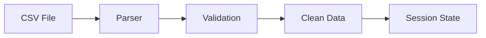
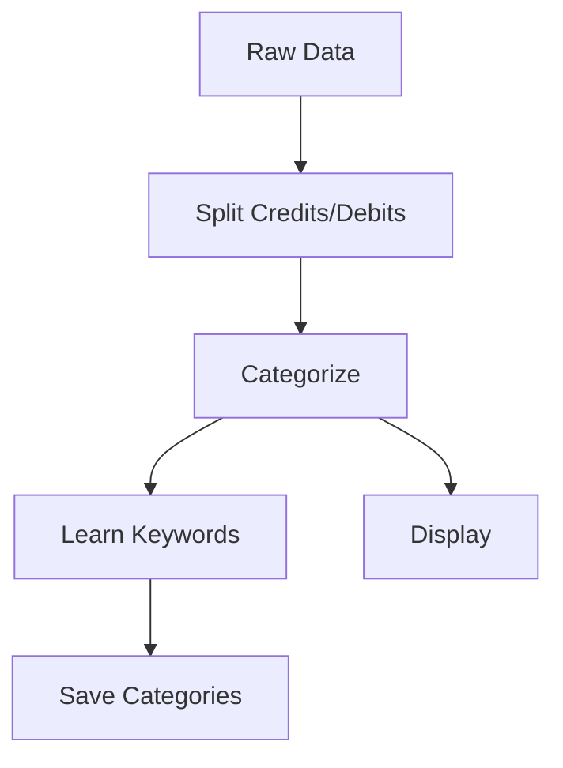
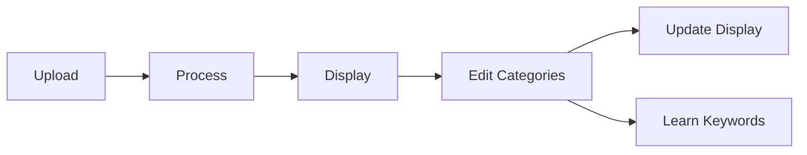

# Technical Context: Personal Finance Dashboard

## Technology Stack

### Core Technologies
1. **Python**
   - Version: 3.x
   - Primary programming language
   - Used for data processing and business logic

2. **Streamlit**
   - Web application framework
   - Handles UI rendering
   - Manages application state

3. **Pandas**
   - Data manipulation library
   - CSV file processing
   - Data analysis and transformation

### Development Environment
- Visual Studio Code as IDE
- Python virtual environment
- Git for version control

## Dependencies

### Core Dependencies
```plaintext
streamlit==1.32.0    # Web application framework
pandas==2.2.0        # Data processing and analysis
plotly==5.18.0      # Interactive visualizations
numpy==1.26.4       # Numerical computations
```

### Development Dependencies
- Requirements are managed via requirements.txt
- Virtual environment is required

## File Structure
```
/
├── main.py              # Application entry point with UI and logic
├── categories.json      # Category configuration with keywords
├── requirements.txt     # Project dependencies
├── bank_statements/     # Bank statement files
│   └── NL90INGB0701483873_17-03-2025_02-05-2025.csv
├── memory-bank/        # Project documentation
└── venv/              # Python virtual environment
```

## Technical Constraints

### 1. Data Processing
- CSV files must be semicolon-separated
- Specific column headers required and handled:
  ```
  "Date";"Name / Description";"Account";"Counterparty";"Code";
  "Debit/credit";"Amount (EUR)";"Transaction type";"Notifications";
  "Resulting balance";"Tag"
  ```
- Amounts handled in European format (comma as decimal)
- Dates parsed in YYYYMMDD format
- Case-insensitive transaction matching

### 2. Performance
- Must handle large CSV files efficiently
- Memory usage optimization required
- Response time should be < 2 seconds

### 3. Browser Support
- Modern web browsers
- Responsive design
- Local processing only

## Configuration Management

### 1. Category Configuration
```json
{
  "category_name": {
    "keywords": ["keyword1", "keyword2"],
    "type": "expense|income"
  }
}
```

### 2. Application Settings
- Default language: Dutch
- Currency: EUR (with European number format)
- Input date format: YYYYMMDD
- Display date format: DD/MM/YYYY

## Development Setup

### 1. Virtual Environment
```bash
# Create virtual environment
python -m venv venv

# Activate virtual environment
# Windows:
venv\Scripts\activate
# Unix:
source venv/bin/activate

# Install dependencies
pip install -r requirements.txt
```

### 2. Running the Application
```bash
# Start the Streamlit application
streamlit run main.py

# Application will be available at:
# http://localhost:8501
```

### 3. Development Commands
```bash
# Update dependencies
pip freeze > requirements.txt

# Run tests (future implementation)
python -m pytest
```

### 4. Category Management
```bash
# Category structure in categories.json
{
  "category_name": [
    "keyword1",
    "keyword2"
  ]
}
```

## Data Flow

### 1. File Import and Processing


### 2. Transaction Processing


### 3. User Interaction Flow


## Security Considerations

### 1. Data Security
- All processing done locally
- No external API calls
- No data storage beyond local files

### 2. Input Validation
- CSV file validation
- Amount format validation
- Category input sanitization

## Testing Strategy

### 1. Unit Testing
- Test data processing functions
- Test categorization logic
- Test amount calculations

### 2. Integration Testing
- Test file import process
- Test category management
- Test visualization generation

### 3. Manual Testing
- UI functionality
- Data visualization
- Error handling

## Future Technical Considerations

### 1. Scalability
- Support for multiple bank formats
- Enhanced categorization algorithms
- Export functionality

### 2. Performance
- Improved caching
- Optimized data structures
- Faster processing algorithms

### 3. Features
- Multi-currency support
- Advanced analytics
- Data export options
